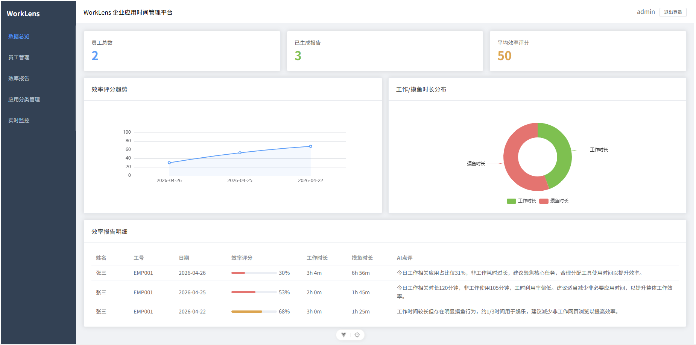
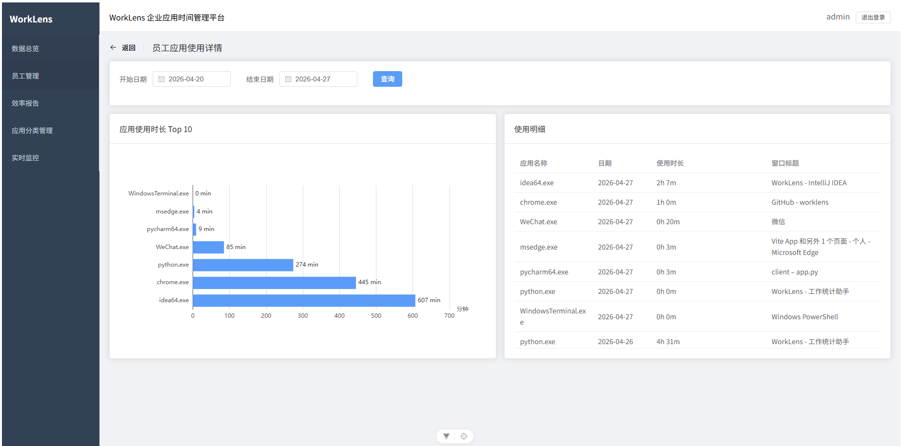
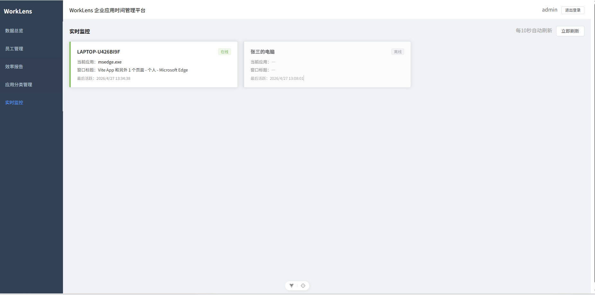
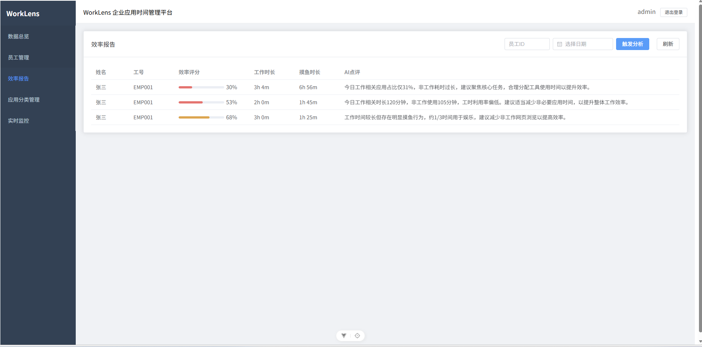
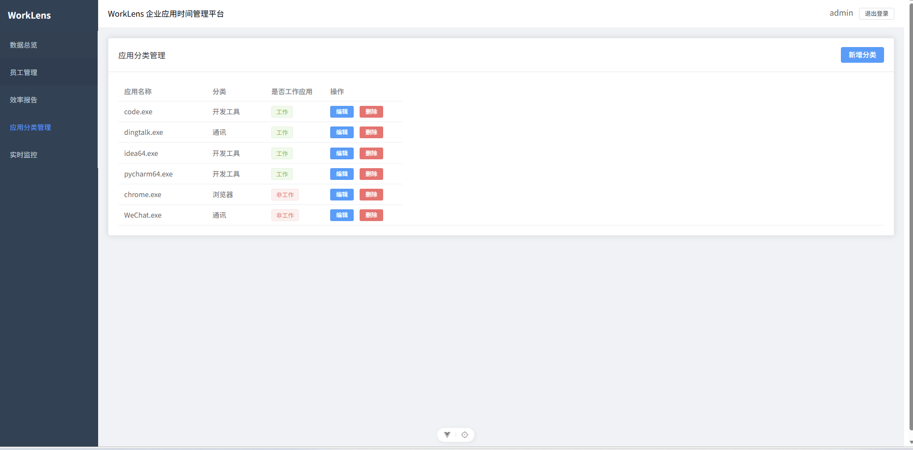

# WorkLens 企业应用时间管理平台

WorkLens 是一个企业员工应用时间监控系统。系统通过采集员工电脑上的应用使用时长，结合规则分类与 AI 分析，自动评估工作时长、摸鱼时长和工作效率。

## 功能特性

- **数据总览**：展示员工效率评分趋势、工作/摸鱼时长分布等核心指标。
- **员工管理**：维护员工信息，并查看单个员工的应用使用详情。
- **效率报告**：基于采集数据自动生成每日工作效率分析报告。
- **应用分类**：自定义配置工作应用和非工作应用分类。
- **实时监控**：查看员工当前使用应用和在线状态。
- **AI 分析**：结合本地规则分类与 DeepSeek 大模型进行双层分析。

## 技术栈

| 模块 | 技术 |
| --- | --- |
| 后端 | Spring Boot 2.6.13、MyBatis、MySQL 8.0 |
| 前端 | Vue 3、Element Plus、ECharts |
| 客户端 | Python、ttkbootstrap |
| AI | DeepSeek API |
| 鉴权 | JWT |

## 项目结构

```text
worklens/
├── backend/      # Spring Boot 后端
├── frontend/     # Vue 3 管理后台
├── client/       # Python 客户端
├── docs/         # 项目截图
└── schema.sql    # 数据库初始化脚本
```

## 页面截图

### 数据总览



### 员工应用使用详情



### 实时监控



### 效率报告



### 应用分类管理



## 快速启动

### 1. 启动数据库

```bash
docker run -d --name worklens-mysql \
  -e MYSQL_ROOT_PASSWORD=worklens123 \
  -e MYSQL_DATABASE=app_monitor \
  -p 3308:3306 \
  --restart unless-stopped \
  mysql:8.0
```

执行 `schema.sql` 初始化数据库表结构。

### 2. 启动后端

配置环境变量：

```bash
DEEPSEEK_API_KEY=你的 Key
JWT_SECRET=自定义密钥
```

启动服务：

```bash
cd backend
mvn spring-boot:run
```

### 3. 启动前端

```bash
cd frontend
npm install
npm run dev
```

### 4. 启动客户端

修改 `client/config.py` 中的 `EMPLOYEE_ID` 和 `SERVER_URL`，然后执行：

```bash
cd client
pip install pywin32 requests psutil ttkbootstrap
python app.py
```

## 默认账号

| 用户名 | 密码 |
| --- | --- |
| `admin` | `admin123` |
